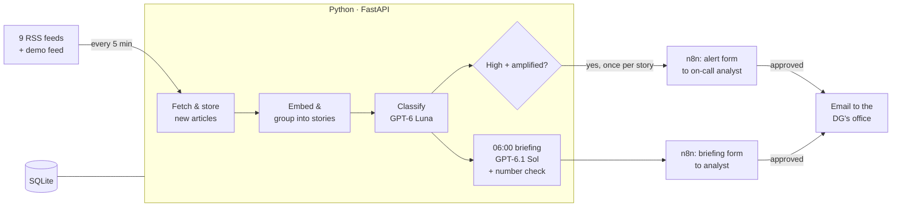

# Marsad


An agentic media-monitoring system for the communications directorate of a Saudi tourism entity. It reads Arabic and English news every 5 minutes, groups articles about the same event, labels what matters, drafts a cited morning briefing for an analyst to edit and approve, and alerts the team when a serious story about the sector starts to spread. **Nothing reaches the Director General without a person approving it.**

Built with **Python**, the **OpenAI API** and **n8n**.

---

## Run it (about 15 minutes)

**You need:** macOS or Linux · [Docker Desktop](https://www.docker.com/products/docker-desktop/) running · Python 3.11+ · an OpenAI API key · a Gmail account with an [app password](https://myaccount.google.com/apppasswords) (2-Step Verification on).

**1. Start everything**
```bash
git clone <this repo> marsad && cd marsad
cp .env.example .env          # then put your OpenAI key in .env
./start.sh                    # first run also installs Python libraries
```
`./start.sh stop` stops everything.

**2. Set up n8n (first time only, ~5 minutes)**, at http://localhost:5678
1. Create the local owner account.
2. **Credentials → Create → SMTP:** user = your Gmail address, password = the app password, host `smtp.gmail.com`, port `465`, SSL on. Name it `Gmail sender`.
3. **Import the two workflows** from the `n8n/` folder: `ingest.json` and `daily-briefing.json` (Create workflow → ⋯ menu → Import from file).
4. In each email node, choose the **Gmail sender** credential and replace the placeholder addresses: `sender@example.com` (your Gmail), `analyst@example.com` (the analyst), `dg-office@example.com` (the DG's office).
5. **Switch both workflows on** (they run on schedule, and the control room's buttons start them through their webhooks).

---

## Try it

Open the **control room**: http://127.0.0.1:8000/. It runs on its own (news every 5 minutes, briefing at 06:00 Riyadh), and its **Controls** run things now:

| Button | What happens |
|---|---|
| **Fetch news now** | Reads all feeds, groups and labels new articles. The page fills in within a minute. |
| **Send briefing to analyst now** | The analyst gets "Daily briefing draft". Open it → **Review and approve** → edit anything → **Approve and send** → the DG's office receives the formatted briefing. |
| **Simulate a crisis (demo)** | Publishes a synthetic negative story into the demo feed and fetches. The analyst gets "⚠ High-risk alert" within a minute → approve → it reaches the DG's office. |

Every briefing and alert appears under **Approvals**: click one to see the exact email that was sent, who approved it and when. Reset the demo: `.venv/bin/python -m monitor.demo reset`.

---

## What was built, requirement by requirement

| The brief asks for | What this does |
|---|---|
| Ingest 8+ sources, Arabic a plus, de-duplicate | **9 publisher RSS feeds, 5 in Arabic.** Exact duplicates are rejected by URL; the same event across outlets and languages is grouped into one *story* using embeddings. |
| Classify against 4 themes, with sentiment, priority and a justification | **GPT-6 Luna** labels every new article. On 30 hand-labelled articles: **every high-risk story caught, no false alarms.** |
| A daily briefing in the directorate's structure, every source cited | **GPT-6.1 Sol** writes it at 06:00. Every sentence cites a numbered source; links come from our database, never from the AI. Every number is checked against its source. |
| Route through n8n to a named analyst; deliver on a schedule | The analyst gets an email with a form, **edits the draft**, approves, and the DG's office receives a formatted email. Who approved what, and when, is recorded. |
| Alert within 15 minutes on high reputational risk | About **5 minutes**. An alert needs the AI to judge a story *about us* and *negative and serious*, **and** the code to count it as *amplified* (an international outlet, or 3+ outlets). One alert per story, approved by an analyst first. |
| Ask the archive questions in plain language | **Cut for time**, as the brief allows. Planned next (the stored embeddings make it straightforward). |

---

## How it works



**n8n is the clock and the switchboard; Python does the work.** n8n triggers ingestion every 5 minutes and the briefing at 06:00, sends the analyst forms, waits for approval and delivers the email. Python fetches, groups, labels, drafts and records.

| File | What it does |
|---|---|
| `sources.yaml` | The news feeds. Add one here; the next run picks it up. |
| `monitor/ingest.py` | Fetches each feed, saves new articles, logs each feed's health. |
| `monitor/stories.py` | Embeds articles (`text-embedding-3-large`) and groups the same event across outlets and languages. |
| `monitor/classify.py` + `prompts/classify.md` | Labels each article: relevance, themes, sentiment, priority, justification. |
| `monitor/briefing.py` + `prompts/briefing.md` | Drafts the briefing, numbers the citations, checks every number, builds the email. Falls back to a plain story list if the AI is down. |
| `monitor/alerts.py` | Turns a story into an alert when it's high **and** amplified, once. |
| `monitor/api.py` | The endpoints n8n calls, and the control room. |
| `monitor/db.py` | The SQLite tables. |
| `monitor/demo.py` | The demo feed: `python -m monitor.demo add` / `reset`. |
| `eval/` | The labelled set and the classification eval. |
| `docs/` | Decisions (`DECISIONS.md`), sources, concepts, plan, demo script. |

---

## Evaluation

30 articles (22 real, 8 synthetic crisis cases, 9 Arabic), hand-labelled by the analyst. **Recall on high-risk comes first:** missing a crisis is the expensive mistake.

| | Result |
|---|---|
| High-risk stories caught | **4 / 4** |
| False alarms | **0** |
| Relevance agreement | 28 / 30 |
| Priority agreement | 28 / 30 |

The remaining disagreements are borderline low-priority items, and they err toward including. Re-run: `.venv/bin/python -m eval.run_eval`. Details and caveats: `docs/DECISIONS.md` (D33). Every live briefing also passes a **number check**: each number must appear in the article its sentence cites; mismatches are shown to the analyst before approval.

---

## Cost

At the directorate's real volume of about **1,500 items a day**: **about $7 a month** in AI costs (classification ~$5.10 with prompt caching, embeddings ~$0.83, the daily briefing ~$0.70; alerts need no AI call). Token counts measured on live calls; breakdown in `docs/ARCHITECTURE.md`.

---

## Security and production

The prototype uses public news only. For confidential documents and a government deployment:
- **Everything runs inside the client's environment:** n8n and the Python service on the client's servers; SQLite becomes **Postgres** with per-role access control.
- **AI inside the walls:** an in-region model deployment, and an open-source embedding model (`bge-m3`) running locally, so no document leaves the network.
- **Audit trail:** every briefing and alert keeps the AI draft, the approved text, who approved it and when.
- **News licensing:** RSS is the publishers' shop window; production should use licensed content, as commercial monitoring services do.

---

## Known limits

- No Q&A over the archive yet (cut for time).
- No social media: the X API is paid.
- Briefings and alerts reach one analyst by email, with no automatic escalation if unanswered. Planned: if the briefing isn't approved by 06:50, send it to a backup analyst (n8n's "Limit Wait Time" on the approval step).
- The model is not perfectly consistent on borderline items; measured, not assumed.
- Saudi outlets without working RSS feeds (e.g. Okaz, Sabq, SPA) are not covered.

Every decision, with its reasoning and trade-off: **`docs/DECISIONS.md`**.
