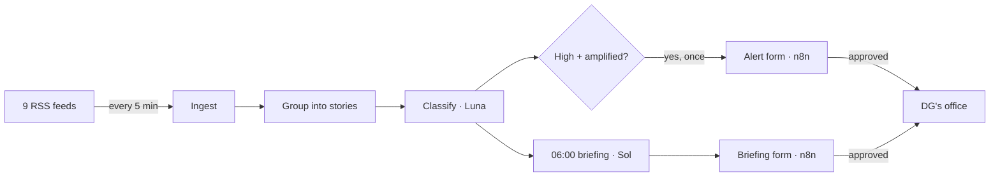

# Marsad

Monitors Arabic and English news for a Saudi tourism communications team, drafts a cited daily briefing, and alerts on negative stories as they spread. An analyst approves everything before it reaches the Director General.

Python · OpenAI API · n8n

---

## Run it

**Needs:** Docker Desktop (running), Python 3.11+, an OpenAI API key, a Gmail account with an [app password](https://myaccount.google.com/apppasswords).

```bash
git clone https://github.com/Taha-Alnasser/Marsad.git && cd Marsad
cp .env.example .env        # add your OpenAI key
./start.sh                  # ./start.sh stop to stop
```

**n8n, first time only** (http://localhost:5678):
1. Create the owner account.
2. Credentials → SMTP: your Gmail, the app password, `smtp.gmail.com`, port `465`, SSL on. Name it `Gmail sender`.
3. Import `n8n/ingest.json` and `n8n/daily-briefing.json`.
4. In each email node: pick `Gmail sender`, replace `sender@`, `analyst@` and `dg-office@example.com` with real addresses.
5. Switch both workflows on.

## Try it

Control room: http://127.0.0.1:8000/

| Button | Result |
|---|---|
| Fetch news now | Reads all feeds; new stories appear |
| Send briefing now | Analyst gets the draft → edits → approves → DG gets it |
| Simulate a crisis | A fake negative story → alert to the analyst → approve → DG gets it |

Reset the demo: `.venv/bin/python -m monitor.demo reset`

---

## The brief, covered

| Requirement | Done |
|---|---|
| 8+ sources, Arabic, dedup | 9 feeds (5 Arabic); same event across outlets = one story |
| Classify: 4 themes, sentiment, priority, reason | GPT-6 Luna, every article |
| Cited daily briefing | GPT-6.1 Sol at 06:00; every number checked against its source |
| n8n approval, scheduled delivery | Analyst edits and approves; DG gets an email; every approval logged |
| Alert within 15 min | ~5 min; only when serious **and** spreading; once per story |
| Q&A over the archive | Cut for time (see below) |

## How it works



| File | Does |
|---|---|
| `sources.yaml` | The feeds |
| `monitor/ingest.py` | Fetch and store new articles |
| `monitor/stories.py` | Group the same event into one story |
| `monitor/classify.py`, `prompts/classify.md` | Label each article |
| `monitor/briefing.py`, `prompts/briefing.md` | Draft the briefing, check numbers, build the email |
| `monitor/alerts.py` | Alert when high and amplified |
| `monitor/api.py` | Endpoints for n8n, and the control room. Briefings and alerts share one approval endpoint (`/briefing/{id}/decision`) by design: alerts are rows in the same table |
| `eval/` | Labelled set and eval script |

## Evaluation

30 hand-labelled articles (22 real, 8 synthetic, 9 Arabic).

| | |
|---|---|
| High-risk caught | **4 of 4** in a labelled set of 30 |
| False alarms | **0** |
| Relevance agreement | 28 / 30 |

Four positives is a small sample: the recall number needs far more labelled crises before it can be trusted.

Run: `.venv/bin/python -m eval.run_eval`

## Cost

**~$7 a month** at 1,500 articles a day. Breakdown in `docs/ARCHITECTURE.md`.

## Designed, not built

| What | Design |
|---|---|
| Escalation | No approval by 06:50 → the draft goes to a backup analyst (a wait-time limit on the approval step). Still none by 07:30 → the DG's office is told the briefing is late |
| Rejected briefing | Today a rejection is recorded and nothing is sent. Next: the analyst's comment goes back to the model for a second draft |
| Q&A over the archive | Search the stored embeddings, answer with cited articles. Cut for time |
| Social media | X API is paid. Cut |
| AI fact-checker | A second model checks names and claims against sources; only after measuring it against analysts |

Decisions and trade-offs: `docs/DECISIONS.md`
