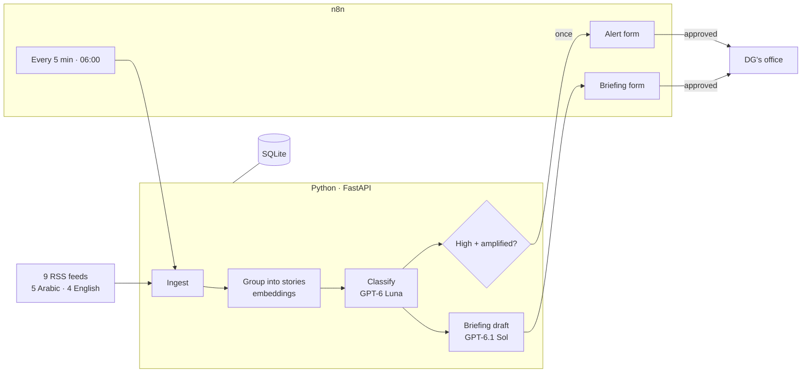

# Marsad: architecture

Monitors Arabic and English news for a Saudi tourism communications team, drafts a cited daily briefing, and alerts on negative stories as they spread. **An analyst approves everything before it reaches the Director General.**

The designed one-page version: `Marsad_architecture.pdf`.

## Components

| Component | Does | Why |
|---|---|---|
| RSS feeds | 9 publishers, 5 in Arabic | Publishers' own feeds, no scraping |
| n8n | Schedules, approval forms, email | Human sign-off built in |
| Python + FastAPI | Fetch, group, classify, draft | Plain code, no agent framework |
| Embeddings | Same event across outlets and languages → one story | Needed to count how far a story spreads |
| GPT-6 Luna | Labels every article | Cheap; caught 4 of 4 crises in the eval, no false alarms |
| GPT-6.1 Sol | Writes the daily briefing | Best quality where the DG reads |
| SQLite | Articles, labels, approvals | Zero setup; Postgres in production |

## Monthly running cost

| Item | Measured per unit | Per month |
|---|---|---|
| Embeddings | 142 tokens per article | $0.83 |
| Classification (Luna) | 1,543 tokens in (99% cached), ~195 out, per article | $5.10 |
| Daily briefing (Sol) | ~6,600 in, ~1,000 out, once a day | $0.70 |
| Alerts | no AI call | $0 |
| n8n | self-hosted, free | $0 |
| **Total** | | **≈ $7** |

At ~1,500 articles a day. Runs on the client's own servers.
