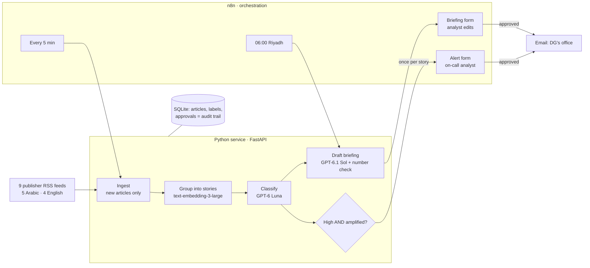

# Marsad: architecture note

**What it is.** A media-monitoring agent for a Saudi tourism communications directorate. It reads Arabic and English news continuously, recognises the same event across outlets and languages, labels what matters, drafts a cited morning briefing, and alerts on serious stories that are spreading. **An analyst approves everything before it reaches the Director General.**

## Components and why

| Component | Role | Why this choice |
|---|---|---|
| **RSS feeds** (`sources.yaml`) | 9 publishers, 5 in Arabic; editable list | Publishers' sanctioned channel; no scraping, no aggregators (D2) |
| **n8n** | Schedules, analyst forms, waiting for approval, email delivery | Every run visible in one place; human-in-the-loop built in (D6, D19) |
| **Python + FastAPI** | Fetch, group, classify, draft, record approvals | Plain code, 8 pinned libraries, no agent framework: every AI call is readable (D25) |
| **Embeddings** (`text-embedding-3-large`) | One "meaning fingerprint" per article; same event = same story, in any language | Spread ("3+ outlets") is a property of stories, not articles (D8, D9, D27) |
| **GPT-6 Luna** | Labels every article: relevance, theme, sentiment, priority, one-line reason | Cheap enough to read everything; measured on hand-labelled data (D14, D33) |
| **GPT-6.1 Sol** | Writes the one daily briefing | Quality matters most where the DG reads (D14) |
| **SQLite** | Articles, stories, labels, briefings and who approved them | Zero setup for a prototype; Postgres in production (D7) |

## Monthly running cost

At the directorate's real volume: **~1,500 articles a day, ~45,000 a month.** Token counts measured on live calls (2026-10-04); OpenAI prices verified 2026-10-02.

| Item | Per unit (measured) | Price | Per month |
|---|---|---|---|
| **Embeddings**, every article (`text-embedding-3-large`) | 142 tokens | $0.13 / 1M tokens | **$0.83** |
| **Classification**, every article (GPT-6 Luna) | 1,543 input tokens, 1,540 of them cached (the instructions repeat) · ~195 output | $0.01 / 1M cached · $0.10 / 1M input · $0.50 / 1M output | **$5.10** |
| **Daily briefing**, once a day (GPT-6.1 Sol) | ~6,600 input · ~1,000 output (≈30 on-topic articles) | $2 / 1M input · $10 / 1M output | **$0.70** |
| **Alerts** | assembled by code, no AI call | – | **$0** |
| **AI total** | | | **≈ $7 / month** |
| n8n (community edition, self-hosted) | – | free licence | $0 |
| Hosting | runs on the client's own servers; for reference, a small cloud VM is ~$20–40 / month | | client's existing infrastructure |

**What moves the number:** without prompt caching, classification would cost about $11 a month. Upgrading classification from Luna to Sol, if the evaluation ever required it, would cost about $100 a month. Volume scales the per-article lines linearly: twice the articles, twice the cost.
