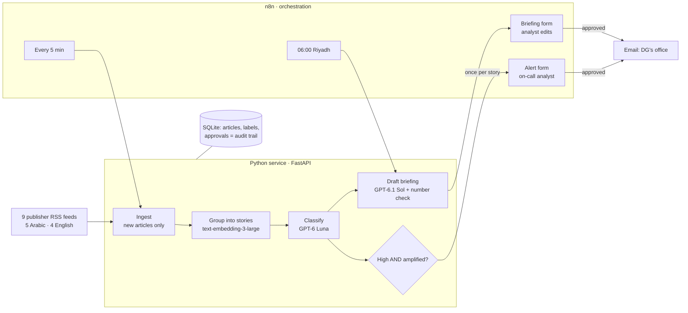

# Marsad: architecture note

**What it is.** A media-monitoring agent for a Saudi tourism communications directorate. It reads Arabic and English news continuously, recognises the same event across outlets and languages, labels what matters, drafts a cited morning briefing, and alerts on serious stories that are spreading. **An analyst approves everything before it reaches the Director General.**

## Components and why

| Component | Role | Why this choice |
|---|---|---|
| **RSS feeds** (`sources.yaml`) | 9 publishers, 5 in Arabic; editable list | Publishers' sanctioned channel; no scraping, no aggregators (D2) |
| **n8n** | Schedules, analyst forms, waiting for approval, email delivery | Every run visible in one place; human-in-the-loop built in (D6, D19) |
| **Python + FastAPI** | Fetch, group, classify, draft, record approvals | Plain code, 8 pinned libraries, no agent framework: every AI call is readable (D25) |
| **Embeddings** (`text-embedding-3-large`) | One "meaning fingerprint" per article; same event = same story, in any language | Spread ("3+ outlets") is a property of stories, not articles (D8, D9, D27) |
| **GPT-6 Luna** | Labels every article: relevance, theme, sentiment, priority, one-line reason | Cheap enough to read everything; measured on hand-labelled data (D14, D33) |
| **GPT-6.1 Sol** | Writes the one daily briefing | Quality matters most where the DG reads (D14) |
| **SQLite** | Articles, stories, labels, briefings and who approved them | Zero setup for a prototype; Postgres in production (D7) |

## How trust is built

- **The AI reads; the code counts.** An alert needs the AI to judge a story *about us* and *negative and serious*, **and** the code to count it as *amplified* (international outlet or 3+ outlets). One alert per story (D35).
- **Every sentence cites a numbered source**; links come from the database, never from the AI. **Every number is checked** against the article it cites; mismatches are shown to the analyst (D31).
- **A person approves everything**, can edit anything, and both versions are kept with name and time (D19).
- **Measured, not assumed:** on 30 hand-labelled articles, every high-risk story caught, no false alarms (D33).

## When something fails

| Failure | Behaviour |
|---|---|
| A feed is down | Logged per source; the briefing names it; the other feeds continue |
| The AI is down at 06:45 | The analyst still gets every story, with a note to write the summary by hand |
| Embeddings or labelling fail mid-run | Articles are already saved; the next run catches up |
| A whole workflow fails | Visible in n8n's execution history |

## Cost

About **$10–15 a month** at the directorate's real volume of ~1,500 items a day (D14).

## From prototype to a government deployment

- **Inside the client's environment:** n8n and the Python service on the client's servers; SQLite → **Postgres with role-based access** ("who can see what").
- **AI inside the walls** for confidential material: an in-region model deployment and a local embedding model (`bge-m3`), so no document leaves the network.
- **Licensed news content** instead of public RSS; social media via a paid API.
- **Next two weeks:** Q&A over the archive (embeddings already stored), escalation to a backup analyst when an approval is late, an AI checker for names and contradictions in briefings (once measured against analysts).

Every decision, with its reasoning and trade-off: `DECISIONS.md` (D1–D37).
